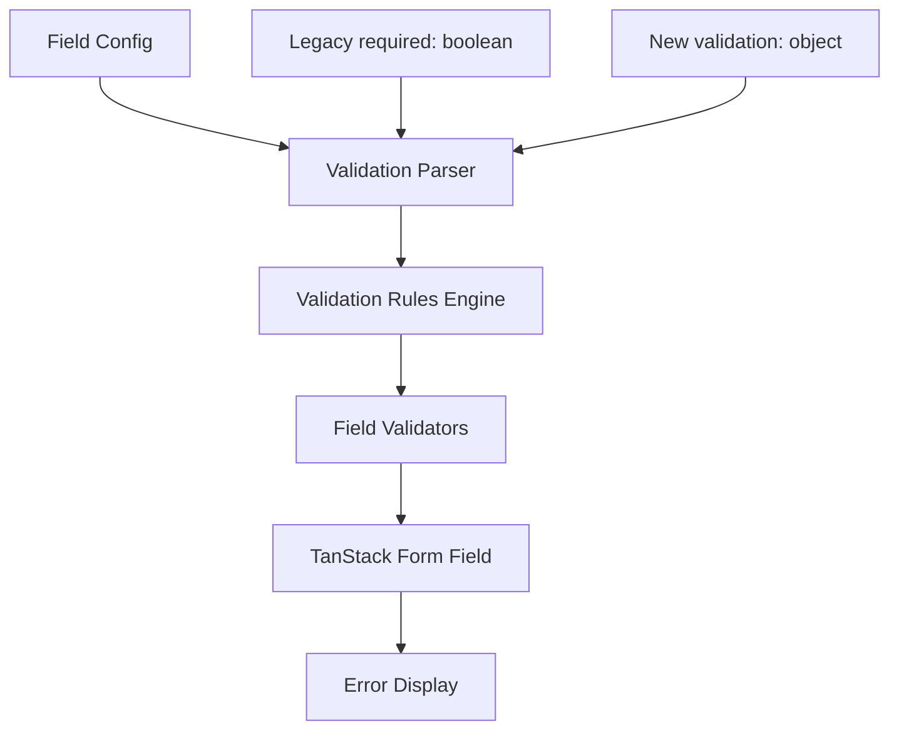

# Enhanced Validation System Design

## Overview

This design enhances the current form validation system to support multiple validation rules per field with custom error messages. The solution maintains backward compatibility while providing a flexible, extensible validation framework that works seamlessly with conditional fields and different field types.

## Architecture

### Current State Analysis

The current system has:
- Basic `required: boolean` validation in field configs
- Hardcoded validation logic in `DynamicField.tsx`
- A `ValidationRule` type that exists but isn't implemented
- Manual validation checks scattered throughout the component

### Proposed Architecture



## Components and Interfaces

### 1. Enhanced ValidationRule Type

```typescript
export type ValidationRule = {
  required?: string | boolean  // Custom message or boolean for backward compatibility
  email?: string              // Custom email validation message
  minLength?: { value: number; message: string }
  maxLength?: { value: number; message: string }
  min?: { value: number; message: string }
  max?: { value: number; message: string }
  pattern?: { value: string; message: string }
  minItems?: { value: number; message: string }  // For arrays
  maxItems?: { value: number; message: string }  // For arrays
  custom?: {
    validate: (value: any, formValues?: any) => boolean | Promise<boolean>
    message: string
  }
}
```

### 2. Validation Configuration Parser

```typescript
interface ValidationConfig {
  rules: ValidationRule
  isRequired: boolean
  fieldType: FieldType
}

class ValidationConfigParser {
  static parse(field: FieldConfig): ValidationConfig
  static isBackwardCompatible(field: FieldConfig): boolean
  static mergeValidationSources(field: FieldConfig): ValidationRule
}
```

### 3. Field Validator Factory

```typescript
interface FieldValidator {
  validate: (value: any, formValues?: any) => string | undefined
  isRequired: boolean
}

class FieldValidatorFactory {
  static create(config: ValidationConfig): FieldValidator
  static createRequiredValidator(message: string): (value: any) => string | undefined
  static createEmailValidator(message: string): (value: any) => string | undefined
  static createLengthValidator(min?: number, max?: number, messages?: {min?: string, max?: string}): (value: any) => string | undefined
  static createNumberValidator(min?: number, max?: number, messages?: {min?: string, max?: string}): (value: any) => string | undefined
  static createPatternValidator(pattern: string, message: string): (value: any) => string | undefined
  static createArrayValidator(minItems?: number, maxItems?: number, messages?: {min?: string, max?: string}): (value: any) => string | undefined
}
```

### 4. Enhanced DynamicField Component

The component will be refactored to:
- Use the validation factory instead of inline validation logic
- Support both legacy and new validation formats
- Handle conditional field validation properly
- Provide consistent error messaging

## Data Models

### Field Configuration Examples

#### Legacy Format (Backward Compatible)
```javascript
{
  name: "email",
  label: "Email",
  type: "email",
  required: true,  // Still supported
  placeholder: "jane@example.com"
}
```

#### New Enhanced Format
```javascript
{
  name: "email",
  label: "Email", 
  type: "email",
  validation: {
    required: "Email is required",
    email: "Please enter a valid email address"
  },
  placeholder: "jane@example.com"
}
```

#### Complex Validation Example
```javascript
{
  name: "password",
  label: "Password",
  type: "password",
  validation: {
    required: "Password is required",
    minLength: { value: 8, message: "Password must be at least 8 characters" },
    pattern: { 
      value: "^(?=.*[a-z])(?=.*[A-Z])(?=.*\\d)", 
      message: "Password must contain uppercase, lowercase, and number" 
    }
  }
}
```

#### Array Field Validation
```javascript
{
  name: "companies",
  label: "Company Information",
  type: "array",
  validation: {
    required: "At least one company is required",
    minItems: { value: 1, message: "Please add at least one company" },
    maxItems: { value: 5, message: "Maximum 5 companies allowed" }
  },
  arrayItemFields: [...]
}
```

## Error Handling

### Error Message Priority
1. Custom validation messages from validation object
2. Default messages for legacy required: true
3. Fallback generic messages

### Error Display Strategy
- Show first validation error that fails
- Clear errors immediately when field becomes valid
- Clear errors when conditional fields become hidden
- Maintain error state consistency across form re-renders

### Conditional Field Error Handling
```typescript
// Pseudo-code for conditional validation
if (field.conditions && !isFieldVisible(field, formValues)) {
  // Skip validation for hidden fields
  return undefined
}
// Apply normal validation for visible fields
return validateField(value, validationConfig)
```

## Testing Strategy

### Component Tests
1. **DynamicField Component Tests**
   - Render fields with new validation format
   - Display custom error messages
   - Handle validation state changes
   - Test conditional field validation behavior

### End-to-End Tests
1. **Form Validation Flows**
   - Complete form validation scenarios
   - Mixed validation rule combinations
   - Conditional field validation scenarios
   - Form submission with validation errors

## Implementation Phases

### Phase 1: Core Validation Infrastructure
- Implement ValidationConfigParser
- Create FieldValidatorFactory
- Add unit tests for core validation logic

### Phase 2: Component Integration
- Refactor DynamicField to use new validation system
- Maintain backward compatibility
- Update error display logic

### Phase 3: Advanced Features
- Implement custom validation functions
- Add support for async validation
- Enhance array field validation

### Phase 4: Testing and Documentation
- Component test coverage
- Update configuration documentation
- Migration guide for existing forms